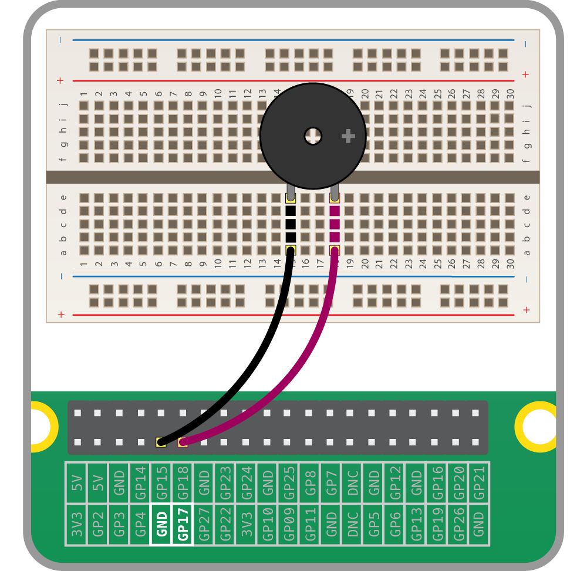

## Using a buzzer

There are two main types of buzzer: *active* and *passive*.

A *passive* buzzer emits a tone when a voltage is applied across it. It also requires a specific signal to generate a variety of tones. The *active* buzzers are a lot simpler to use, so these are covered here.

### Connecting a buzzer

An *active* buzzer can be connected just like an LED, but as they are a little more robust, you won't be needing a resistor to protect them.

--- task ---

Set up the circuit as shown below:



--- /task ---

--- task ---

Add `Buzzer` to the `from gpiozero import...` line:

```python
from gpiozero import Buzzer
from time import sleep
```

--- /task ---

--- task ---

Add a line below your creation of `button` and `lights` to add a `Buzzer` object:

```python
buzzer = Buzzer(17)
```

--- /task ---

--- task ---

In GPIO Zero, a `Buzzer` works exactly like an `LED`, so try adding a `buzzer.on()` and `buzzer.off()` into your loop:

```python
while True:
    buzzer.on()
    sleep(1)
    buzzer.off()
    sleep(1)
```

--- /task ---

--- task ---

A `Buzzer` has a `beep()` method which works like an `LED`'s `blink`. Try it out:

```python
while True:
    buzzer.beep()
```

--- /task ---


### Using a button to activate the buzzer

Now let's add a button to control your buzzer, so it only sounds when the button is pressed.

--- task ---

Connect a button to your Raspberry Pi as shown below:


--- /task ---

--- task ---

Add `Button` to your import line:

```python
from gpiozero import Button, Buzzer
from time import sleep
```

--- /task ---

--- task ---

Create a `Button` object in your code:

```python
button = Button(2)
```

*(Here, `2` is the GPIO pin number connected to your button. Adjust it if you're using a different pin.)*

--- /task ---

--- task ---

Modify your loop to activate the buzzer when the button is pressed:

```python
while True:
    if button.is_pressed:
        buzzer.on()
    else:
        buzzer.off()
```

--- /task ---

Now, when you press the button, the buzzer should sound!


